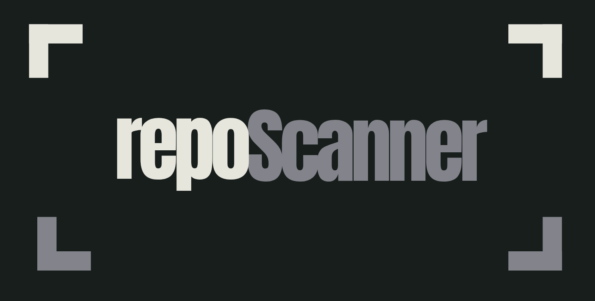

<div align = "center">



<a href = "LICENSE.md">
</a>
<a href = "https://www.python.org/downloads/">
</a>
<a href = "https://github.com/tecnolgd/repoScanner">
</a>
<a href = "https://github.com/tecnolgd/repoScanner/releases">
</a>
<a href = "#documentation">
</a>

</div>

>**repoScanner** is a lightweight repository analysis tool for developers.          
>- Quickly understand your codebase structure, dependencies, and metrics with a single command.
>- Built for developers with the intent of saving time and peace-of-mind

## What It Does

- **Directory Analysis**: Scan total files, lines of code, average file size, etc.
- **Dependency Detection**: Extract and map dependencies (Python imports, C/C++ includes)
- **Language Breakdown**: See what languages dominate your repo
- **Smart Reporting**: Choose between quick stats or detailed developer mode
- **JSON Export**: Machine-readable reports for automation
- **Native File Utilities**: Optional `vendor/libcvault` submodule supports advanced CLI file sorting, search, and byte/line metrics when initialized.

## Features

**Dual Reporting Modes**
- **Stats Mode** (default): High-level summary—perfect for a quick glance
- **Raw Mode**: File-by-file dependency details for developers who need everything

**Key Metrics**
- Total files and lines of code
- Per-file dependency counts
- Language distribution
- Largest files and most-dependent files
- File mapping with dependencies(for --dev/raw mode)     

**Zero External Dependencies**     
- Built entirely using the Python Standard Library.
- No external packages or `pip install` commands are required.


## Requirements

- Python 3.12+ (tested on Ubuntu 24.04 LTS)

> The code uses only Python standard libraries and should be compatible with Python 3.10+,
> but has been officially tested on Python 3.12.

## Build Instructions

```bash
git clone https://github.com/tecnolgd/repoScanner.git
```
```bash
cd repoScanner
```

## Optional `libcvault` native helper (advanced CLI modes)

The core `repoScanner` functionality is pure Python and does not require external packages beyond a Python interpreter.
The `vendor/libcvault` submodule provides optional native helpers used only for advanced CLI modes such as `--sort`, `--max`, `--search`, `--lc`, and `--tbytes`.

To fetch the bundled native helper after cloning the repository:

```bash
git submodule update --init --recursive vendor/libcvault
```

- `git submodule init` registers the submodule in your local repo configuration.
- `git submodule update --init` also clones and checks out the correct commit for the submodule.

If you later want to refresh `libcvault` from its remote repository, run:

```bash
git submodule update --remote vendor/libcvault
```

This updates the submodule to the latest commit from its configured branch. You should then review and commit the updated submodule pointer in the main repo.

If you want to use the advanced `libcvault`-backed CLI modes, build the native extension from `bridge.cpp` and `vendor/libcvault/main.cpp`.

```bash
g++ -O3 -shared -std=c++17 -fPIC -I/usr/include/python3.12 -I vendor/libcvault vendor/bridge.cpp vendor/libcvault/main.cpp -o libcvault$(python3-config --extension-suffix)
```

### Tool Execution/Run

The easiest way to use repoScanner is with the provided shell script wrapper:

```bash
./reposcan <path> [--stats|--raw|--dev|--bench]
```

**Examples:**

- **Quick Summary** (Recommended)
  ```bash 
  ./reposcan .                      # Scan current directory (stats mode)
  ./reposcan /path/to/repo          # Scan a specific path (default: stats mode)
  ./reposcan /path/to/repo --stats  # Explicitly use stats mode
  ```

- **Detailed Analysis** (Developer Mode - Tree with File Mapping)
  ```bash
  ./reposcan /path/to/repo --raw    # File-by-file with dependency tree
  ./reposcan /path/to/repo --dev    # Same as --raw (alias)
  ```

- **Run Benchmarks**
  ```bash
  ./reposcan --bench                # Execute the built-in benchmark harness
  ```

The `--raw` / `--dev` mode displays all files in a tree structure with their dependencies mapped, perfect for detailed codebase analysis.

- **Get Help**
  ```bash
  ./reposcan --help                 # Show all available options
  ./reposcan -h    #Same as --help(alias)
  ```

#### Alternative: Direct Python Execution

- You can also run the scanner directly:

  ```bash
  python3 -m repoScan.cli /path/to/repo          # Stats mode (default)
  python3 -m repoScan.cli /path/to/repo --raw    # Detailed analysis with dependency tree
  python3 -m repoScan.cli /path/to/repo --dev    # Same as --raw (alias)
  ```

- Advanced utility modes (requires the bundled `vendor/libcvault` submodule):

  ```bash
  python3 -m repoScan.cli /path/to/repo --sort              # Sort files by byte size
  python3 -m repoScan.cli /path/to/repo --max               # Show the largest file
  python3 -m repoScan.cli /path/to/repo --search filename    # Search for a file
  python3 -m repoScan.cli /path/to/repo --lc filename        # Show line count for a file
  python3 -m repoScan.cli /path/to/repo --tbytes            # Show total bytes in a directory
  ```

- Help command
  ```bash
  python3 -m repoScan.cli /path/to/repo --help    # Same as -h
  ```

### Output
Reports are automatically saved to `output/report.json`

## Performance & Benchmarking

`repoScanner` includes a built-in automated performance profiling harness to track filesystem traversal latency and processing velocity across massive directory trees.

The benchmark suite programmatically allocates a temporary mock repository(`perf_test_sandbox`) containing thousands of deeply nested files across multiple language profiles (`.py`, `.cpp`, `.md`) to stress-test system I/O bounds, executes the scanner via the shell wrapper, and enforces strict post-run sandbox sanitation.

### Running the Benchmarks

To execute the performance suite and generate a local processing velocity report, run:

```bash
python3 tests/benchmark.py
```
or use shell command

```bash
./reposcan --bench
```

> [!TIP]        
> Check the [sample outputs](assets/docs/architecture.md#sample-execution) for more info.


## Supported Languages

Detects and maps **40+ extensions** to human-readable names, including:
* **Systems:** C, C++, Rust, Go, Zig, Swift
* **Web:** HTML, CSS, JavaScript, TypeScript, PHP
* **Data:** JSON, YAML, TOML, SQL, XML
* **Scripting:** Python, Ruby, Lua, Shell, PowerShell and many more. 
*(Unrecognized extensions fall back to their raw string format).*

## Documentation
* [Architecture](assets/docs/architecture.md)
* [Roadmap](assets/docs/roadmap.md)

## [Contributing](CONTRIBUTING.md)

## Contributors

A huge thanks to the developers contributing to repoScanner.
- [@Ghraven](https://github.com/Ghraven)
- [@AzarAI-TOP](https://github.com/AzarAI-TOP)
- [@Benjamin Ayiovh](https://github.com/BenjaminAyivoh1)


## Author & License
- **Author:** tecnolgd
- **License:** [MIT](LICENSE.md)