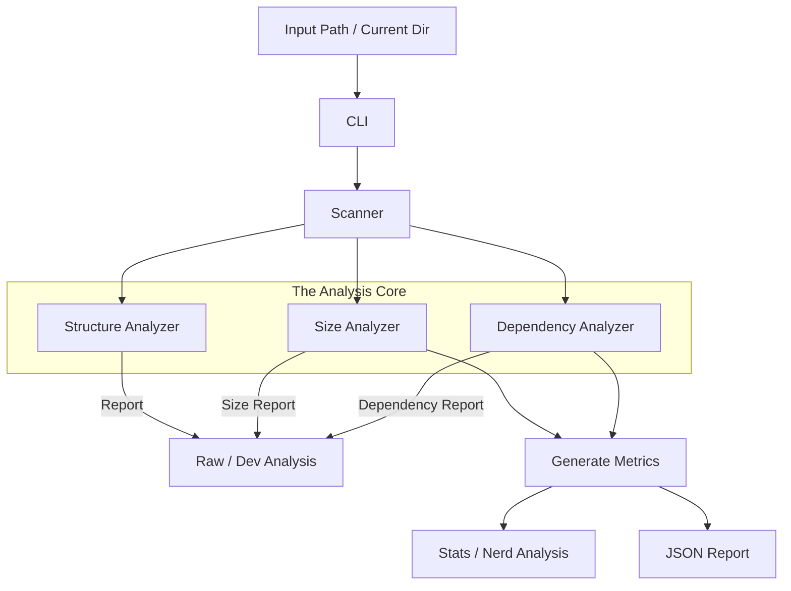

<!--Architecture details and breakdown for repoScanner-->

## Architecture Overview

This document describes the high-level architecture of the repoScanner project, its key components, data flow, and guidance for extending or running the tool.

**Goals:**

- **Discoverable:** scan repository trees quickly and reliably.
- **Extensible:** add new analyzers and report formats with minimal changes.
- **Testable:** provide repeatable outputs suitable for benchmarking and CI.

**Core Components:**

- **scanner/**: Responsible for repository traversal and raw data collection (file lists, dependency hints, file sizes).     
Example files: [dirScanner.py](../../repoScan/scanner/dirScanner.py).
- **analyzer/**: Implements domain-specific analysis of the raw scan data. Current analyzers include size and structure analysis.      
Example files: [sizeAnalyzer.py](../../repoScan/analyzer/sizeAnalyzer.py), [structureAnalyzer.py](../../repoScan/analyzer/structureAnalyzer.py), [dependencyAnalyzer.py](../../repoScan/analyzer/dependencyAnalyzer.py).
- **scanner/metrics.py**: Aggregates basic metrics and performs derived calculations used by analyzers and reports.       
See [metrics.py](../../repoScan/scanner/metrics.py).
- **reports/**: Renders analysis results in multiple formats (`terminal`, `JSON`).        
Example files: [terminalReports.py](../../repoScan/reports/terminalReports.py), [jsonReports.py](../../repoScan/reports/jsonReports.py) and [htmlReports.py](../../repoScan/reports/htmlReports.py) (Currently unavailable).
- **cli.py**: CLI entrypoint and orchestration layer. Responsible for wiring together scanning, analysis, and report generation. See [cli.py](../../repoScan/cli.py).
- **output/**: Default location for produced artifacts such as `report.json`.
- **assets/data/**: Example and test data used by development and CI.     
Example: [testData.txt](../data/testData.txt).

**Data Flow**

1. The CLI triggers the scanner to walk the repository tree and collect raw file metadata.
2. The raw scan output is consumed by one or more **analyzers** (size, structure, dependency).
3. Analyzer outputs are aggregated by `metrics` to produce normalized statistics and summaries.
4. Results are handed to the reports layer to produce output artifacts (terminal summary, JSON files, or HTML pages placed under `output/`).

Mermaid overview:



**Extension Points**

- Add a new analyzer: implement a new module under `repoScan/analyzer/` that accepts normalized scan data and returns structured results. Plug it into the CLI orchestration.
- Add a new report format: implement a new renderer under `repoScan/reports/` that consumes analyzer output and writes artifacts.
- Add new scanner rules: extend `repoScan/scanner/dirScanner.py` or add dependency heuristics in `repoScan/analyzer/dependencyAnalyzer.py` to include more file heuristics.

**Testing & Benchmarking**
- Unit tests and quick benchmarks live in `tests/` (for example, [tests/benchmark.py](../../tests/benchmark.py)). Use the sample data in `assets/data/` to create deterministic test cases.

**Running locally (example)**
1. Run the CLI against a path to scan and write JSON output:

```bash
python repoScan/cli.py --path . --output output/report.json --format json
```

2. Run the benchmark script:

```bash
python tests/benchmark.py
```

**Design Notes & Rationale**
- Separation of concerns: scanning, analyzing, and reporting are intentionally decoupled to keep each component small and testable.
- Normalized intermediate model: analyzers consume a consistent data model produced by the scanner+metrics layer to simplify adding new analyzers.

**Next steps**
- Add sequence diagrams for complex analyzer interactions (optional).
- Expand the example JSON schema produced by `jsonReports` into a spec file for portability.
- HTML report generation via some module under `repoScan/reports`.