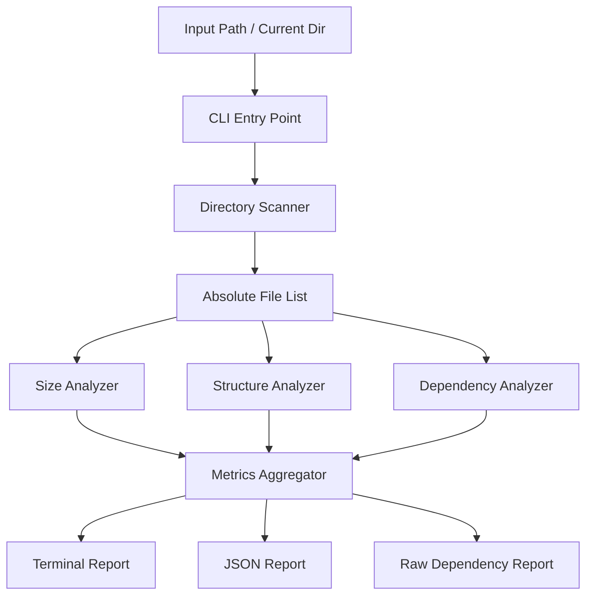

<!--Architecture details and breakdown for repoScanner-->

## Architecture Overview

This document describes the high-level architecture of the repoScanner project, its key components, data flow, and guidance for extending or running the tool.

**Goals:**

- **Discoverable:** scan repository trees quickly and reliably.
- **Extensible:** add new analyzers and report formats with minimal changes.
- **Testable:** provide repeatable outputs suitable for benchmarking and CI.

**Core Components:**

- **scanner/**: Traverses directories and collects file paths. [dirScanner.py](../../repoScan/scanner/dirScanner.py) uses `libcvault` when available and otherwise falls back to `os.walk`.
- **scanner/libcvault_wrapper.py**: Provides the shared native-helper availability check, root-level population, and cached scan result boundary.
- **analyzer/**: Converts normalized file lists into domain results. Current analyzers are [sizeAnalyzer.py](../../repoScan/analyzer/sizeAnalyzer.py), [structureAnalyzer.py](../../repoScan/analyzer/structureAnalyzer.py), and [dependencyAnalyzer.py](../../repoScan/analyzer/dependencyAnalyzer.py).
- **scanner/metrics.py**: Aggregates analyzer output into the normalized metrics object consumed by reports.
- **reports/**: Renders terminal and JSON results. [terminalReports.py](../../repoScan/reports/terminalReports.py) and [jsonReports.py](../../repoScan/reports/jsonReports.py) are implemented; [htmlReports.py](../../repoScan/reports/htmlReports.py) is currently a placeholder.
- **utility/helpers.py**: Implements file utilities, language mapping, CLI help, and native-helper fallbacks.
- **vendor/libcvault**: Optional native C++ submodule used for optimized file operations.
- **reposcan**: Shell wrapper that forwards commands to `python3 -m repoScan.cli` and supports `--bench`.
- **cli.py**: CLI entrypoint and orchestration layer for scanning, analysis, mode-specific utilities, terminal output, and JSON serialization.
- **output/**: Default location for generated artifacts such as `report.json`.
- **tests/**: Contains the benchmark harness and pytest tests for scanner, analyzer, and metrics behavior.

**Data Flow**

1. The CLI resolves the requested root and selected mode.
2. `dirScanner` walks the repository, using `libcvault` when available or Python's `os.walk` otherwise.
3. The scanner returns absolute file paths, which are cached for the current process and root.
4. The size, structure, and dependency analyzers consume the same file list.
5. `generate_metrics` combines analyzer outputs into the normalized report model.
6. The CLI prints the requested terminal view and writes the normalized metrics to `output/report.json`.
7. Utility modes may use the native helper directly or use the Python fallback for the same operation.

Mermaid overview:

```mermaid
flowchart TD
    Input[Input Path / Current Dir] --> CLI[CLI Entry Point]
    CLI --> Scanner[Directory Scanner]
    Scanner --> Files[Absolute File List]
    Files --> Size[Size Analyzer]
    Files --> Structure[Structure Analyzer]
    Files --> Dependency[Dependency Analyzer]
    Size --> Metrics[Metrics Aggregator]
    Structure --> Metrics
    Dependency --> Metrics
    Metrics --> Terminal[Terminal Report]
    Metrics --> JSON[JSON Report]
    Metrics --> Raw[Raw Dependency Report]
```

**Current behavior notes**

- The scanner caches files by absolute root path within one Python process.
- Dependency analysis currently recognizes Python imports and C/C++ includes.
- Language names are derived from a fixed extension map; unknown extensions remain as their raw extension.
- HTML report generation is not implemented in the current codebase.
- The JSON report is the single normalized artifact; analyzer internals are not serialized directly.

**Testing & Benchmarking**
- Benchmark and test guidance is available in [assets/docs/testing.md](testing.md).
- Usage examples are available in [assets/docs/usage.md](usage.md).

**Design Notes & Rationale**

- Scanning, analyzing, and reporting are intentionally separated so each layer can be tested independently.
- The file list is the common input to analyzers, while `generate_metrics` becomes the normalized report boundary.
- Native operations are isolated behind `libcvault_wrapper`, allowing the CLI to retain a standard-library fallback.
- The CLI remains the orchestration point for both scan modes and utility commands.

**Next steps**

- Add sequence diagrams for complex analyzer interactions.
- Define a stable JSON schema specification with versioned fields.
- Implement HTML report generation under `repoScan/reports`.
- Add circular dependency detection and repository-aware scanning options.
